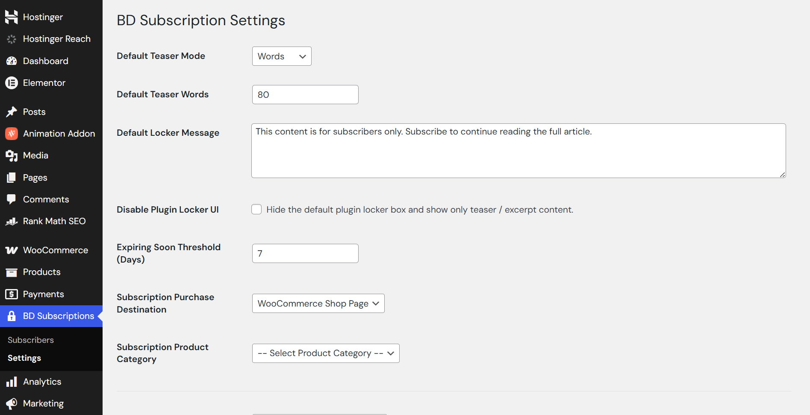
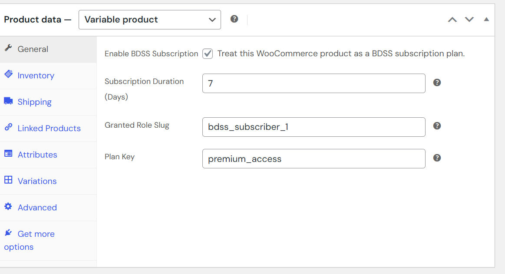
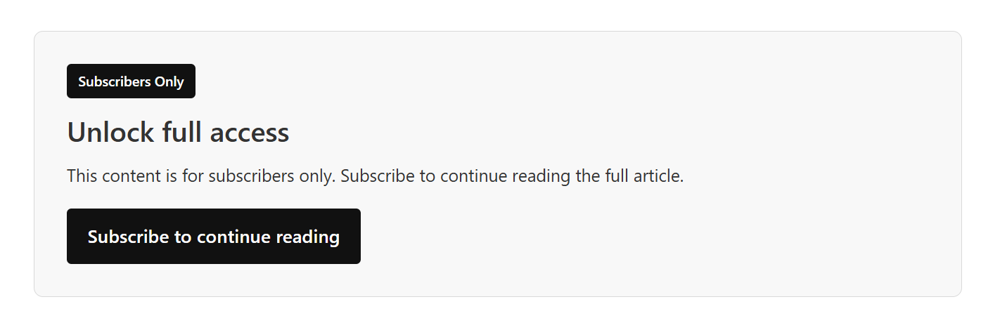
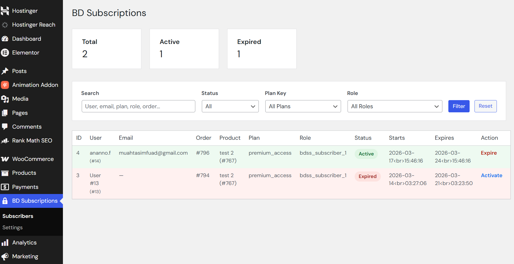
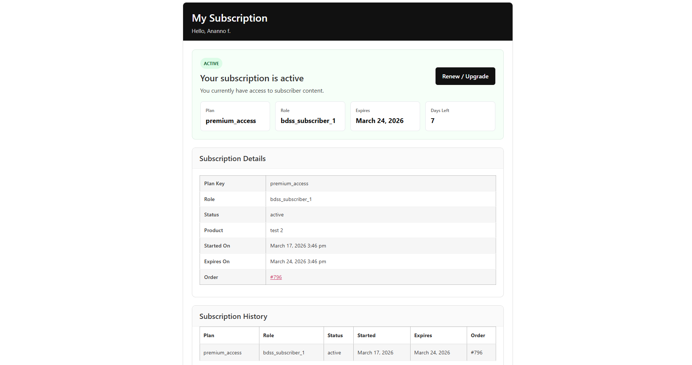
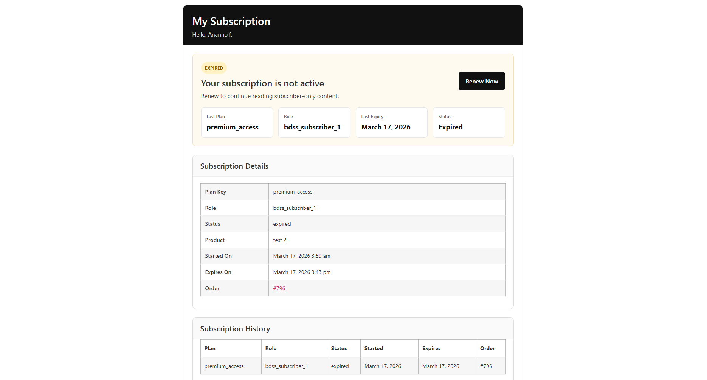

# BD Subscription System

A WooCommerce-based subscription and content protection plugin for WordPress with fixed-duration access control, subscriber management, and protected content workflows.

## Overview

BD Subscription System is designed to help WordPress site owners manage subscription-based access using WooCommerce-supported payment methods.

It is built for practical business use cases where site owners need:
- fixed-duration subscription access
- protected or member-only content
- simple subscriber management
- shortcode-based frontend integration
- compatibility with standard WooCommerce payment workflows

This project is especially useful for publishers, premium content platforms, membership websites, and subscription-based digital businesses.

## Key Features

- Fixed-duration subscription access
- WooCommerce-powered purchase flow
- Content protection and post locking
- Subscriber access management
- Expiry and renewal handling
- Shortcode-based subscription status display
- User dashboard functionality
- Admin settings and access control tools
- Support for practical local and international payment workflows through WooCommerce

## Why This Project Matters

Many WordPress site owners want to sell access to premium content, but existing solutions can be complex, expensive, or poorly suited to practical business workflows.

BD Subscription System aims to simplify that process by combining:
- familiar WooCommerce checkout and payment systems
- controlled access to protected content
- business-friendly subscription handling
- easier WordPress integration for real-world use cases

## Use Cases

This plugin can be used for:

- News and media membership websites
- Premium article and blog access
- Paid reports or research content
- Subscriber-only resource libraries
- Private educational or documentation content
- Content-based subscription businesses

## Tech Stack

- WordPress
- WooCommerce
- PHP
- HTML
- CSS
- JavaScript

## Plugin Structure

    bd-subscription-system/
    ├── assets/
    ├── docs/
    ├── includes/
    ├── .gitignore
    ├── CHANGELOG.md
    ├── LICENSE
    ├── README.md
    ├── bd-simple-subscription.php
    ├── readme.txt
    └── uninstall.php

## Current Status

This project is under active development and ongoing improvement.

The current version focuses on building a practical subscription and content-locking system for WordPress using WooCommerce as the payment and order foundation.

## Planned Improvements

- Better locker UI and content preview experience
- Improved admin controls and settings flow
- More flexible subscription plan handling
- Better shortcode and page setup experience
- Improved user dashboard experience
- Cleaner onboarding for site owners

## Installation

See the full installation guide here:

- [Installation Guide](docs/installation.md)

## Documentation

Project documentation:

- [Installation Guide](docs/installation.md)
- [Shortcodes](docs/shortcodes.md)
- [Roadmap](docs/roadmap.md)

## Screenshots

## Screenshots

### Settings Page

### Product Setting

### Locker UI

### Subscribers List

### Active Subscriber Status

### Non-Active Subscriber Status

## Author

**Muahtasim Fuad**

## License

This project is licensed under the GPLv2 or later license.
